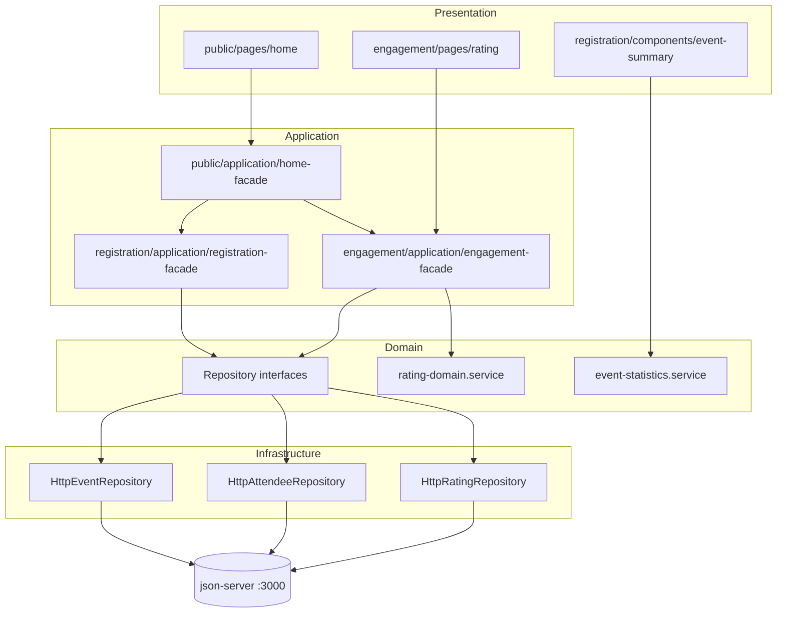

# Eventify — Plataforma de gestión de eventos

## Descripción de la aplicación

Eventify es el frontend web del caso de examen **Pregunta 1 (Eventify)**. Permite consultar eventos registrados con estadísticas (asistentes con check-in y calificación promedio) y enviar calificaciones mediante el identificador de ticket.

## Autor

| Campo | Valor |
|-------|-------|
| **Código** | U202319440 |
| **Proyecto** | `upc2402si729eau202319440` |
| **Curso** | SI729 — Desarrollo de Aplicaciones Open Source |
| **Universidad** | UPC |
| **Ciclo** | 2024-2 |

---

## Tecnologías

- Angular 18 (componentes **standalone**)
- Angular Material (tema `indigo-pink`)
- TypeScript + `HttpClient`
- `@ngx-translate/core` (EN por defecto, ES)
- `json-server` 0.17.4 (`server/db.json`)

---

## Cómo ejecutar

### 1. Backend simulado

```bash
cd server
npx json-server --watch db.json
```

API: `http://localhost:3000`

### 2. Frontend

```bash
npm install
ng serve
```

App: `http://localhost:4200`

### Rutas

| Ruta | Vista |
|------|-------|
| `/` | Redirige a `/home` |
| `/home` | Home — eventos registrados |
| `/engagement/ratings/new` | Formulario de calificación |
| `/**` | 404 — página no encontrada |

---

## Arquitectura: DDD + capas (criterios C04 y C05)

El enunciado exige **subdominios (Bounded Contexts)** con carpetas `pages`, `components`, `services` y `model`.  
La rúbrica **C05** exige además separar la lógica en **cuatro capas**:

| Capa DDD | Responsabilidad | Carpeta en este proyecto |
|----------|-----------------|---------------------------|
| **Domain** | Entidades, reglas de negocio, puertos (interfaces de repositorio) | `domain/` |
| **Application** | Casos de uso, orquestación entre dominio e infraestructura | `application/services/` |
| **Infrastructure** | HTTP, adaptadores que implementan los puertos | `infrastructure/repositories/` |
| **Presentation** | UI Angular: componentes, plantillas, binding | `pages/`, `components/` |

### Relación enunciado ↔ capas DDD

El examen nombra `model` y `services` a nivel de contexto. Aquí se mapean así:

| Carpeta del enunciado | Equivalente DDD en este repo |
|----------------------|------------------------------|
| `model/` | `domain/model/` (entidades) |
| `services/` (lógica HTTP mezclada) | **Separado en** `application/services/` + `infrastructure/repositories/` |
| `pages/` y `components/` | **Presentation** |

> **Importante para el examen:** si el profesor pide literalmente carpetas `model/` y `services/` en la raíz del contexto, puedes **mover** `domain/model` → `model` y dejar `application` + `infrastructure` como subcarpetas; la lógica y la separación de capas no cambian.

---

## Bounded Contexts: de dónde salen y qué capas tienen

Los cuatro contextos los define el **enunciado del examen**, no se inventan al azar. Cada uno agrupa un lenguaje ubicuo distinto dentro de Eventify.

```
src/app/
├── public/          → UI general (Home)
├── shared/          → Elementos transversales (toolbar, 404)
├── registration/    → Eventos y asistentes
└── engagement/      → Calificaciones
```

### 1. `shared` — Contexto compartido (kernel de UI)

| ¿Por qué existe? | Componentes reutilizados en toda la app: barra de navegación, 404, i18n en toolbar. |
|------------------|-------------------------------------------------------------------------------------|
| **Capas DDD** | Solo **Presentation** (`components/`). No hay reglas de negocio ni API propia. |
| **Carpetas** | `components/toolbar`, `components/page-not-found` |

No necesita `domain/`, `application/` ni `infrastructure/` porque no modela un subdominio del negocio.

---

### 2. `public` — Contexto de experiencia pública

| ¿Por qué existe? | El enunciado pide un subdominio `public` para la vista Home (`/home`). |
|------------------|-----------------------------------------------------------------------|
| **Capas DDD** | |
| Presentation | `pages/home/` — grid responsive, títulos, i18n |
| Application | `application/services/home-facade.service.ts` — **orquesta** `registration` + `engagement` para cargar datos del Home |
| Domain / Infrastructure | **No propios** — delega en otros contextos |

El Home necesita eventos, asistentes **y** calificaciones; eso cruza contextos, por eso la orquestación vive en `public/application` y no en un componente.

---

### 3. `registration` — Contexto de registro (eventos + asistentes)

| ¿Por qué existe? | Entidades `events` y `attendees` del API; el Home muestra resúmenes por evento. |
|------------------|----------------------------------------------------------------------------------|
| **Origen en el dominio** | “Registrar” eventos y quién asistió (`checkedInAt`). |
| **Capas DDD** | |

```
registration/
├── domain/
│   ├── model/              → Event, Attendee
│   ├── repositories/       → EventRepository, AttendeeRepository (puertos)
│   └── services/           → EventStatisticsService (reglas: conteo check-in, promedio)
├── application/
│   └── services/           → RegistrationFacadeService (casos de uso)
├── infrastructure/
│   ├── repositories/       → HttpEventRepository, HttpAttendeeRepository
│   └── tokens/             → Inyección de puertos
└── components/             → event-summary (Presentation)
```

**Reglas de dominio destacadas** (`EventStatisticsService`):

- **Checked-in attendees:** asistentes del evento con `checkedInAt !== null`.
- **Average rating:** media solo de calificaciones de asistentes que **sí** hicieron check-in; 1 decimal; si no hay, la UI muestra “No ratings”.

---

### 4. `engagement` — Contexto de participación (calificaciones)

| ¿Por qué existe? | Ruta `/engagement/ratings/new` y entidad `ratings` del API. |
|------------------|-------------------------------------------------------------|
| **Origen en el dominio** | Interacción post-evento: valorar la experiencia. |
| **Capas DDD** | |

```
engagement/
├── domain/
│   ├── model/              → Rating
│   ├── repositories/       → RatingRepository
│   └── services/           → RatingDomainService (ticket válido, check-in, duplicado)
├── application/
│   └── services/           → EngagementFacadeService (submitRating)
├── infrastructure/
│   ├── repositories/       → HttpRatingRepository
│   └── tokens/
└── pages/
    └── rating/             → Presentation (formulario)
```

**Reglas de dominio** (`RatingDomainService`):

1. Ticket no encontrado → `invalidTicket`
2. Ticket sin `checkedInAt` → `notAttended`
3. Ya existe rating mismo `attendeeId` + `eventId` → `alreadyRated`
4. OK → crea `Rating` con `ratedAt` actual y POST vía repositorio

`engagement` **lee** asistentes del contexto `registration` (mismo API) a través del puerto `AttendeeRepository` inyectado — patrón habitual cuando dos contextos comparten datos en un frontend monolítico.

---

## Flujo de datos (resumen)



---

## Inyección de dependencias (`app.config.ts`)

Los puertos del dominio se enlazan a adaptadores HTTP en el arranque:

```typescript
{ provide: EVENT_REPOSITORY, useClass: HttpEventRepository },
{ provide: ATTENDEE_REPOSITORY, useClass: HttpAttendeeRepository },
{ provide: RATING_REPOSITORY, useClass: HttpRatingRepository },
```

Así los facades dependen de **interfaces**, no de `HttpClient` directamente (criterio C05: persistencia en Infrastructure).

---

## Plantilla para otro examen (qué reemplazar)

Usa esta checklist al adaptar el proyecto a otro enunciado:

| Paso | Acción |
|------|--------|
| 1 | Renombrar proyecto (`angular.json`, `package.json`) a `upc2402si729eau<tu-código>` |
| 2 | Identificar **entidades del API** → un Bounded Context por agregado lógico (como `registration` / `engagement`) |
| 3 | Por cada contexto con negocio: crear `domain/model`, `domain/repositories`, reglas en `domain/services` |
| 4 | Casos de uso en `application/services/*-facade.service.ts` |
| 5 | Llamadas HTTP en `infrastructure/repositories/http-*.repository.ts` + tokens |
| 6 | UI en `pages/` (rutas) y `components/` (reutilizables) |
| 7 | Vistas que cruzan contextos → facade en `public/application` (o en el contexto que actúe como “orquestador”) |
| 8 | `shared/` solo para toolbar, 404, pipes comunes — **sin capas** |
| 9 | Actualizar `app.config.ts` con los nuevos tokens |
| 10 | JSDoc `@summary` + `@author` en cada `.ts` |
| 11 | `public/i18n/en.json` y `es.json` |
| 12 | `server/db.json` según entidades del nuevo caso |

### Archivos clave por capa (ejemplo actual)

| Capa | Archivos de referencia |
|------|------------------------|
| Domain | `registration/domain/services/event-statistics.service.ts` |
| Application | `engagement/application/services/engagement-facade.service.ts` |
| Infrastructure | `registration/infrastructure/repositories/http-event.repository.ts` |
| Presentation | `engagement/pages/rating/rating.component.ts` |

---

## Cumplimiento de la rúbrica (referencia rápida)

| Criterio | Cómo lo cubre este proyecto |
|----------|------------------------------|
| **C01** Build | `ng build` / `ng serve` sin errores |
| **C02** Home + UI + i18n + 404 | Rutas, Material, responsive, `ngx-translate`, `page-not-found` |
| **C03** Rating | Validaciones en dominio + mensajes i18n |
| **C04** Organización DDD | 4 bounded contexts + capas internas |
| **C05** Calidad / capas | Lógica de negocio en `domain`, orquestación en `application`, HTTP en `infrastructure`, UI en `pages/components` |
| **C06** Nomenclatura | Identificadores en inglés, convenciones Angular |

---

## Entrega del zip

1. Eliminar `node_modules`
2. Comprimir la carpeta del proyecto
3. Nombre: `upc-pre-202402-si729-<sección>-ea-u<tu-código>.zip`

---

## Datos de prueba (`server/db.json`)

| Ticket | Escenario |
|--------|-----------|
| `TICKET-001` | Check-in OK, puede calificar (si no calificó antes) |
| `TICKET-003` | Sin check-in → mensaje “not attended” |
| `TICKET-999` | No existe → “invalid ticket” |
| `TICKET-001` (segunda vez) | Ya calificó evento 1 → “already rated” |
